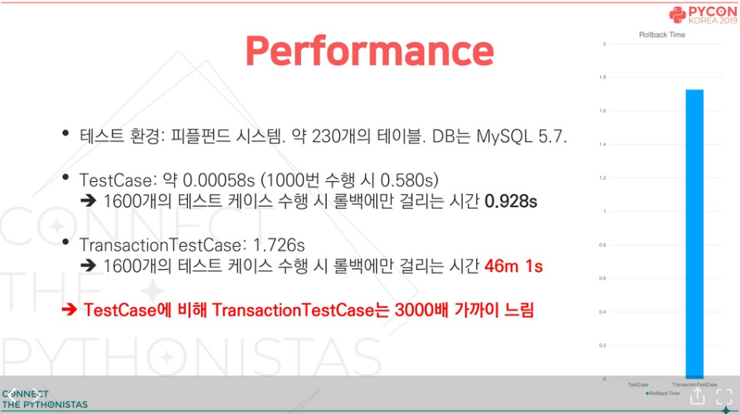

<!-- _class: slide-1 -->

# 데일리샷 Django 테스트

---
<!-- _class: slide-2 -->

:loudspeaker: 이 슬라이드 내용은 Django 테스트의 튜토리얼, 이론 등이 아닙니다. 데일리샷 프로젝트에서 Django 테스트를 작성 했을 때 경험하고 공유하고 싶었던 내용들을 담고 있습니다 :)

---
<!-- _class: slide-3 -->

# 목차

1. Mock
2. `setUpTestData`와 `setUp`의 차이
3. TestCase 클래스
4. 고민을 하게 되었던 테스트 상황들

---

<!-- _class: slide-4 title-page -->

# Mock

---

<!-- _class: slide-5 -->

# Mock은 왜 쓰나요?

### 특정 메소드 실제로 실행 안시키기
```python
def send_mail():
    # 메일 보내는 함수
    ...

def some_func():
    send_mail()


class SomeTestCase(TestCase):
    def test_some_func(self):
        with patch("some_module.send_mail"):
            some_func() # 테스트 실행 시 메일을 보내지 않음
```

---

<!-- _class: slide-6 -->

# Mock은 왜 쓰나요?

### 메소드 실행 여부 파악
```python
def send_mail():
    # 메일 보내는 함수
    ...

def some_func():
    send_mail()


class SomeTestCase(TestCase):
    def test_some_func(self):
        with patch("some_module.send_mail") as mock_send_mail:
            some_func()

            mock_send_mail.assert_called() # 호출 됐음을 테스트 한다.
```


---

<!-- _class: slide-7 -->
# Mock은 왜 쓰나요?


### DB 동작 없이 모델 객체 생성

```python
class SomeTestCase(TestCase):
    def test_some_func(self):
        mock = Mock(spec=Product)

        self.assertTrue(isinstance(mock, Product))
```

---

<!-- _class: slide-8 -->

# Mock 기본 사용법

```python
class ProductionClass:
    def method(self):
        self.something(1, 2, 3)

    def something(self, a, b, c):
        pass

real = ProductionClass()
real.something = Mock()
real.method()
real.something.assert_called_once_with(1, 2, 3)

real.something.side_effect = Exception("exception!!")
with self.assertRaises(Exception):
    real.method()
```
<p class="reference">출처: https://docs.python.org/ko/3.8/library/unittest.mock-examples.html</p>

---

<!-- _class: slide-9 -->
# Mock(spec=SomeClass)

해당 클래스의 메서드와 속성에 접근 할 수 있다.

```python
mock = Mock(spec=Product)
self.assertTrue(isinstance(mock, Product))
```
---

<!-- _class: slide-10 -->

<style scoped>
pre {
    font-size: 17px;
}
</style>

# patch

모듈의 함수나 클래스를 패치 하고자 할 때 전역 스코프로써 모킹 것이 아닌 일정 스코프에서 모킹하기 위한 데코레이터입니다. 

```python
class SomeClass:
    def func1():
        func2()

    def func2():
        pass

mock = Mock(spec=SomeClass)

def test_1():
    mock.func1()
    mock.func2.assert_called_once()

test_1()

def test_2():
    mock.func1()
    mock.func2.assert_called_once()

test_2() # 테스트 통과 X
```

---

<!-- _class: slide-11 -->

# patch

```python
from unittest.mock import patch 

@patch("some_module.func")
def test_func(mock_func):
    ...

def test_func():
    with patch("some_module.func") as mock_func:
        ...
```

---

<!-- _class: slide-12 -->

# patch 위치 잡기

```python
# a.py

def func():
    pass

# b.py
def my_func():
    func()

# mocking 되지 않음
@patch("a.func")
def test_my_func(mock_func):
    ...

# 정상적으로 mocking 됨
@patch("b.func")
def test_my_func(mock_func):
    ...
```

---

<!-- _class: slide-13 -->


# 모델 patch 시 고려할 점

```python
# Payment가 mocking 되서 DoesNotExists는 mocking 된 속성. Exception 클래스가 아니다.
with patch("some.models.Payment") as mock:
    mock.objects.get.side_effect = Payment.DoesNotExists() 

# 이럴 때는 objects까지 mocking 해서 테스트 진행
with patch("some.models.Payment.objects") as mock:
    mock.get.side_effect = Payment.DoesNotExists()
```

---

<!-- _class: title-page slide-14 -->

# `setUpTestData`와 `setUp`의 차이

---

<!-- _class: slide-14 -->

<style scoped>
pre {
    font-size: 17px;
}
</style>


# `setUpTestData`

TestCase를 상속 받는 테스크 클래스에서 클래스 범위 내에서 공통적으로 쓰일 수 있는 데이터를 만드는 함수

```python
from django.test import TestCase

class MyTests(TestCase):
    @classmethod
    def setUpTestData(cls):
        # Set up data for the whole TestCase
        cls.foo = Foo.objects.create(bar="Test")
        ...

    def test1(self):
        # Some test using self.foo
        ...

    def test2(self):
        # Some other test using self.foo
        ...
```
<p class="reference">출처: https://docs.djangoproject.com/en/4.0/topics/testing/tools/#testcase</p>

---

<!-- _class: slide-15 -->


# `setUp`

각 테스트 별로 쓰이는 데이터를 만들 때 사용하는 메서드

```python
from django.test import TestCase

class MyTests(TestCase):
    def setUp(self):
        self.foo = 0

    def test1(self):
        self.foo += 1

    def test2(self):
        print(self.foo) # 0
```

---

<!-- _class: title-page slide-16 -->

# TestCase 클래스

---

<!-- _class: slide-17 -->

<style scoped>
    section {
        text-align: center
    }
</style>

# TestCase 상속 관계

 

---

<!-- _class: slide-18 -->


# `SimpleTestCase`

```python
from django.test import SimpleTestCase

class MyTests(SimpleTestCase):
    ...
```

- 데이터베이스 쿼리 사용을 막음
- 한 함수의 플로우와 예외를 테스트 할 때 유용하게 씀
- 당연히 데이터베이스 쿼리를 허용하지 않아서 빠른 테스트가 가능
- Mock을 이용하면 모델을 사용하는 함수 또는 클래스도 테스트 가능

---

<!-- _class: slide-19 -->


# `TransactionTestCase`

```python
from django.test import TransactionTestCase

class ProductTransactionTestCase(TransactionTestCase):
    def test_1(self):
        ...  # TRUNCATE TABLE Product; (그 외 사용 된 테이블 개수만큼 더 실행)
    
    def test_2(self):
        ...  # TRUNCATE TABLE Product; (그 외 사용 된 테이블 개수만큼 더 실행)
```

- 각 테스트가 끝날 때 마다 모든 테이블을 truncate(테이블은 두고 테이블이 가지고 있는 데이터 날림)함으로써 각 테스트 별로 데이터의 겹침이 없이 테스트 가능
- 실제로 데이터베이스에서 commit, rollback 함으로써 데이터베이스와 어떻게 상호작용하는지 알 수 있음

---

<!-- _class: slide-20 -->

<style scoped>
    li {
        font-size: 23px;
    }
</style>

# `TestCase`

```python
from django.test import TestCase

class ProductTestCase(TestCase): # BEGIN TRANSACTION;
    def test_1(self): # SAVEPOINT S1;
        ...           # ROLLBACK TO SAVEPOINT S1;
    
    def test_2(self): # SAVEPOINT S2;
        ...           # ROLLBACK TO SAVEPOINT S2;

    # ROLLBACK;
```

- Django에서 흔히 쓰이는 클래스
- 테스트들을 atomic 블락으로 감싸게 됨
- 각 테스트가 끝날 때마다 atomic으로 감싼 transaction이 롤백 됨
- 그러므로 특정 database transaction 테스트를 하는것에 적정되지 않음
- setUpTestData는 클래스 레벨에서 atomic 블락으로 감싸게 됨

---

<!-- _class: slide-21 -->

<style scoped>
    section {
        text-align: center
    }
</style>

# `TransactionTestCase`는 테스트 속도를 느리게 한다



<p class="reference">출처: https://speakerdeck.com/youngminkoo/pycon-kr-2019-teseuteue-geolrineun-siganeul-star-92-percent-star-juligi?slide=24</p>

---

<!-- _class: slide-22 -->

# `TransactionTestCase`는 테스트 속도를 느리게 한다

- 그러므로 `SimpleTestCase`와 `TestCase`를 주로 사용하자
- `on_commit()`과 `select_for_udpate()` 함수는 TestCase의 특성 상(atomic 블록으로 감싸지는 특성) `TransactionTestCase` 클래스를 사용 할 수 밖에 없음
    - 참고: [mocking을 이용하여 `on_commit()`을 TestCase에서 테스트 하기](https://medium.com/@juan.madurga/speed-up-django-transaction-hooks-tests-6de4a558ef96)

---

<!-- _class: title-page slide-23 -->

# 고민을 하게 되었던 테스트 상황들

---

<!-- _class: slide-24 -->

# Serializer 테스트 시 serializer.ImageField

serializer 테스트 시 context에 request를 넘겨야 할 경우가 있음. 이때 serializer에서 이미지 필드를 사용하고 있으면 [`HttpRequest.build_absolute_uri`](https://docs.djangoproject.com/en/4.0/ref/request-response/#django.http.HttpRequest.build_absolute_uri)가 동작해서 테스트가 의도한대로 흘러가지 않음.
image 필드가 테스트에 중요하지 않으면 아래 처럼 mocking해서 image 필드가 None이 되게 해서 테스트 진행 가능

ImageField가 상속 받는 FileField의 to_represetation 메서드 [참고](https://github.com/encode/django-rest-framework/blob/ad282da97cf7b23c50a8fa7b7c5cad68c1deedc3/rest_framework/fields.py#L1572)

```python
mock_request = Mock()
mock_request.user = receiver_user
mock_request.build_absolute_uri.return_value = None

self.assertDictEqual(
    dict(
        id=foo.id,
        image=None
    ),
    SomeSerializer(foo, context={"request": mock_request}).data,
)
```

---

<!-- _class: slide-25 -->

# models.ImageField 용 더미 데이터 만들기

```python
import tempfile

event = Event.objects.create(
    name="이벤트",
    image=tempfile.NamedTemporaryFile(suffix=".jpg").name,
)
```

---

<!-- _class: slide-26 -->

# 환경 변수에 따른 테스트

```python
with self.settings(SERVER_ENV="production"):
    ...

@override_settings(SERVER_ENV="test", TEST_SERVER_DOMAIN="test.domain")
def test_base_pay_library_test_env(self):
    ...
```
<p class="reference">출처: https://docs.djangoproject.com/en/4.0/topics/testing/tools/#overriding-settings</p>

---

<!-- _class: slide-27 -->

# redis 실제 사용 후 초기화하기

테스트 시 실제로 redis를 사용 후 테스트가 끝날 때 저장한 데이터를 지워야 할 때가 있음

```python
class MyTestCase(TestCase):
    def test_func(self):
        # redis 연결 후 테스트 진행
        ...

    def tearDown(self) -> None:
        get_redis_connection("default").flushall()
```

---

<!-- _class: slide-28 -->

# 동시성 테스트

여러 클라이언트에서 동시에 실행 하는 함수 또는 뷰를 테스트 할 상황이 있음

`ThreadPoolExecutor` 클래스를 사용해서 여러 스레드로 생성 후 동시성 테스트 진행 가능

```python
from concurrent.futures import ThreadPoolExecutor, wait

def concurrent_func(arg):
    ...

class TestCase(TestCase):
    def test_concurrent_func(self):
        with ThreadPoolExecutor(max_workers=10) as executor:
            futures = []

            for payment in payment_list:
                futures.append(executor.submit(concurrent_func, "argument"))

            wait(futures)
```

---

<!-- _class: title-page slide-29 -->

# 끝